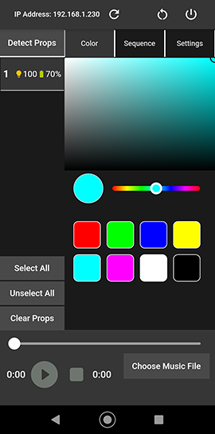

# Bento Remote

This is a smartphone app for controlling LED props that conform to the [Bento OSC command API](https://bkuperberg.gitbook.io/bento-docs/firmware-hardware/command-api) like the Flowtoys Creators Clubs.
It is based on Flutter so it can be compiled for Android and iOS smartphones. However, it has not been compiled or tested for iOS by the authors.

## Features

- Detect props
- Set colors
- Start sequences (synchronized to music)
- Set RGB LED brightness, IR LED brightness
- Shutdown props

## The Bento Project

- [Bento App](https://github.com/benkuper/BenTo/)
- [Bento Documentation](https://bkuperberg.gitbook.io/bento-docs/)
- [Bento Discord](https://discord.gg/kedAeCbKUM)

## Where can I get it?

The latest apk files (Android) are attached to the Github releases.
Or you can build it yourself.

## Building the Bento Remote app
### Requirements

- Any IDE with Flutter SDK installed (Android Studio, VSCode, etc.)

### Build the App for Android
https://flutter.dev/docs/deployment/android

## Screenshot

